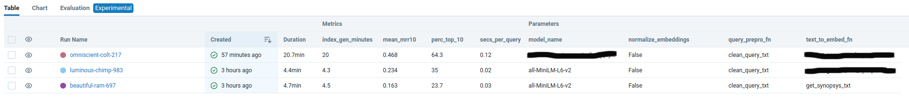

# Ejercicio práctico sesión 2 - Desarrollo del módulo de *retrieval* de un sistema RAG

Oscar Andres Pinilla Leon

Imaginemos que estamos desarrollando un *chatbot* para recomendar películas que, entre otras funciones, tiene
un módulo de *retrieval* que se encarga de buscar las películas que más se ajusten a una descripción dada. 

<p align="center">
    
</p>

Como el foco está en el módulo de *retrieval* vamos a suponer que la descripción de la película (o *query*) ya nos 
viene dada. Podemos imaginar que esta *query* es el resultado de una conversación entre el bot y el usuario donde, 
después de recabar sus preferencias, el "chatbot engine" genera una descripción de lo que quiere el usuario. Por tanto, suponemos
que esta *query* nos viene dada, y que siempre empezará con la frase "El usuario busca...". Por ejemplo:

```
El usuario busca una película de habla hispana, idealmente un drama carcelario que trate temas como la amistad
```

Nuestro módulo de retrieval se encarga de encontrar las películas que más se ajusten a esta descripción, y se la devuelve al
"chatbot engine" para que lo use como contexto adicional que el LLM puede usar para recuperar una película concreta. 

## Datos

Usaremos una base de datos con información de 6,521 películas almacenadas en PostgreSQL. Toda la información que tenemos
de cada película se carga en nuestro código como un objeto de la clase `Movie`, siempre con los mismos atributos. Por ejemplo:

```python
Movie(
    movie_id: 828416
    title_es: "El lobo de Wall Street"
    title_original: "The Wolf of Wall Street"
    duration_mins: 179
    year: 2013
    country: "Estados Unidos"
    genre_tags: Comedia;Drama;Comedia negra;Biográfico;Bolsa & Negocios;Años 80;Años 90;Drogas # Siempre separados por ;
    tv_show_flag: False # Si es una serie o una película
    director_top_5: Martin Scorsese
    script_top_5: Terence Winter;Jordan Belfort # Siempre separados por ;
    cast_top_5: Leonardo DiCaprio;Jonah Hill;Margot Robbie;Kyle Chandler;Cristin Milioti # Siempre separados por ;
    photography_top_5: Rodrigo Prieto
    synopsis: "Película basada en hechos reales del corredor de bolsa neoyorquino ..."
)
```


## Evaluación del sistema

Hemos creado un dataset con 300 ejemplos de *query* y película que debería recuperar, y hemos decidido usar el [MRR@10](https://en.wikipedia.org/wiki/Mean_reciprocal_rank) como **principal métrica técnica a optimizar**, aunque reportaremos alguna métrica más. En, concreto:

* `mean_mrr10`: El valor medio de MRR@10 para los 300 ejemplos
* `perc_top_10`: El porcentaje de ejemplos en los que la película correcta está en el top 10 recuperado
* `secs_per_query`: El tiempo medio que tarda el sistema en recuperar las 10 películas más simialres a una *query* dada
* `index_gen_time`: El tiempo que tarda el sistema en generar los embeddings para todas las películas

El dataset se puede descargar de [este link](https://grupovass-my.sharepoint.com/:u:/g/personal/gabriel_munozr_intelygenz_com/EV0xH27mzcZLgA8Hnr9wdGoBJxZ9eBzELasvfkox5Q9qDQ?e=OSdQHm) y deberá guardarse en `/bootcamp-ia-sprint-4/retrieaval/evaluation/data/eval_queries.json`


## Ejercicio

El ejercicio consiste en realizar varios experimentos probando con diferentes enfoques y parámetros. Para monitorizar y guardar
los resultados de nuestros experimentos usaremos un servidor local de [MLFlow](https://mlflow.org/docs/latest/index.html). 

Para acotar el ejercicio, limitamos los parámetros y enfoques con los que se puede experimentar a:

* La función usada para generar, a partir del objeto `Movie`, el texto con el que generaremos los embeddings. El alumno es libre de usar cualquier función que se le ocurra (deberá definirla en `retrieval/indexing_pipeline_utils.py` e indicarla como `_text_to_embed_fn` en `retrieval/config`). Como ejemplo se incluye una muy básica (`get_synopsys_txt`).

* El modelo de embeddings a usar. El código acepta cualquier modelo de HuggingFace. Deberá indicarse en `retrieval/config` en la variable `model_name` (por ejemplo `all-MiniLM-L12-v2`).
  
* La función usada para procesar la query de entrada. El alumno es libre de usar cualquier función que se le ocurra (deberá definirla en `retrieval/retrieval_pipeline_utils.py` e indicarla como `_query_prepro_fn` en `retrieval/config`). Como ejemplo se incluye `clean_query_txt`.

El alumno debe ejecutar al menos tres experimentos distintos (a.k.a "mlflow runs") donde modifique alguno o varios de esos parámetros para intentar mejorar la métrica `mean_mrr10` que se obtiene con el baseline que viene por defecto en el código:


<p align="center">
    
</p>


Los **entregables** son:

* Una captura de pantalla donde se vea el "dashboard de MLFlow del alumno con los experimentos de MLflow realizados, incluyendo las métricas y parámetros obtenidos. Por ejemplo:


<p align="center">
    
</p>


* Una Pull Request al repositorio con el código que permita replicar dichos experimentos


## Notas importantes (!!)

* Para realizar el ejercicio y jugar con los parámetros mencionados arriba, no es necesario que el alumno modifique nada 
del código a excepción de la configuración en `retrieval/config.py` y posibles nuevas funciones 
en `retrieval/indexing_pipeline_utils.py` y `retrieval/retrieval_pipeline_utils.py`. Si una vez realizado los tres 
experimentos como pide el enunciado, el alumno quiere cambiar / añadir cualquier parte del código para ver si consigue 
mejorar más la métrica o cualquier otra mejora, es más que bienvenido.

* Los embeddings tardan tiempo en generarse si no se dispone de una GPU, especialmente si se usan modelos más grandes
que el que viene por defecto. Por eso, se ha incluido una funcionalidad de "cache" que comprueba si ya se ha generado
un índice con embeddings con la misma configuración y, si es así, lo carga del cache en lugar de volver a generarlo. Para 
que este "cache" funcione correctamente, si se desea hacer cambios en la función que pasamos como `_text_to_embed_fn` 
(p.ej. en `get_synopsys_txt`) no vale con hacer cambios dentro de esa función, si no que hay que darle un nuevo nombre a 
la función (nota: este caché es un "hack" para este ejercicio, en realidad se usan métodos más robustos como
los [data pipelines de DVC](https://dvc.org/doc/start/data-pipelines/data-pipelines)).


## Instrucciones para crear el entorno y ejecutar el código

## Instalar conda (y Python)

Si no tienes `conda` instalado, instala `miniconda` (una distribución de conda) siguiendo
los pasos según tu sistema operativo [indicados en este link](https://docs.anaconda.com/free/miniconda/). 

Además esto instalará Python en tu equipo si no lo tienes.

## Crear un entorno conda para este repositorio

Cierra la terminal y abre otra (esto es importante para que tengan efecto los cambios tras instalar `conda`).
Dirígete a la carpeta donde clonaste este repositorio y ejecuta:

```bash
path/en/tu/equipo/bootcamp-ia-sprint-4$ conda create --name movies python=3.11
conda activate movies
conda env create -f environment.yml
```

### MLruns

 ```
 mlflow server --host 127.0.0.1 --port 8080
 ```
