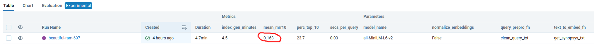

# Ejercicio práctico sesión 2 - Desarrollo del módulo de *retrieval* de un sistema RAG
Antoni Amaya Obrador
- [Ejercicio práctico sesión 2 - Desarrollo del módulo de *retrieval* de un sistema RAG](#ejercicio-práctico-sesión-2---desarrollo-del-módulo-de-retrieval-de-un-sistema-rag)
  - [Introducción](#introducción)
  - [Datos](#datos)
  - [Evaluación del sistema](#evaluación-del-sistema)
  - [Ejercicio](#ejercicio)
  - [Notas importantes (!!)](#notas-importantes-)
  - [Instrucciones para crear el entorno y ejecutar el experimento base](#instrucciones-para-crear-el-entorno-y-ejecutar-el-experimento-base)
    - [Instalar git](#instalar-git)
    - [Crea un fork del repositorio y clona el repositorio en tu ordendador.](#crea-un-fork-del-repositorio-y-clona-el-repositorio-en-tu-ordendador)
    - [Instalar conda (y Python)](#instalar-conda-y-python)
    - [Abre el repositorio en tu IDE de preferencia](#abre-el-repositorio-en-tu-ide-de-preferencia)
    - [Instala el entorno de Python](#instala-el-entorno-de-python)
    - [Descarga los datos necesarios](#descarga-los-datos-necesarios)
    - [Lanzar el servidor de MLFlow](#lanzar-el-servidor-de-mlflow)
    - [Lanza el experimento configurado por defecto](#lanza-el-experimento-configurado-por-defecto)


## Introducción

Imaginemos que estamos desarrollando un *chatbot* para recomendar películas que, entre otras funciones, tiene
un módulo de *retrieval* que se encarga de buscar las películas que más se ajusten a una descripción dada. 

<p align="center">
    
</p>

Como el foco está en el módulo de *retrieval* vamos a suponer que la descripción de la película (o *query*) ya nos 
viene dada. Podemos imaginar que esta *query* es el resultado de una conversación entre el bot y el usuario donde, 
después de recabar sus preferencias, el "chatbot engine" genera una descripción de lo que quiere el usuario. Por tanto, suponemos
que esta *query* nos viene dada, y que siempre empezará con la frase "El usuario busca...". Por ejemplo:

```
El usuario busca una película de habla hispana, idealmente un drama carcelario que trate temas como la amistad
```

Nuestro módulo de retrieval se encarga de encontrar las películas que más se ajusten a esta descripción, y se la devuelve al
"chatbot engine" para que lo use como contexto adicional que el LLM puede usar para recuperar una película concreta. 

## Datos

Usaremos una base de datos con información de 6,521 películas. Toda la información que tenemos
de cada película se carga en nuestro código como un objeto de la clase `Movie`, siempre con los mismos atributos. Por ejemplo:

```python
Movie(
    movie_id: 828416
    title_es: "El lobo de Wall Street"
    title_original: "The Wolf of Wall Street"
    duration_mins: 179
    year: 2013
    country: "Estados Unidos"
    genre_tags: Comedia;Drama;Comedia negra;Biográfico;Bolsa & Negocios;Años 80;Años 90;Drogas # Siempre separados por ;
    tv_show_flag: False # Si es una serie o una película
    director_top_5: Martin Scorsese
    script_top_5: Terence Winter;Jordan Belfort # Siempre separados por ;
    cast_top_5: Leonardo DiCaprio;Jonah Hill;Margot Robbie;Kyle Chandler;Cristin Milioti # Siempre separados por ;
    photography_top_5: Rodrigo Prieto
    synopsis: "Película basada en hechos reales del corredor de bolsa neoyorquino ..."
)
```

Ver sección [Descarga los datos necesarios](#descarga-los-datos-necesarios) para obtener el link de descarga.

## Evaluación del sistema

Hemos creado un dataset con 300 ejemplos de *query* y película que debería recuperar, y hemos decidido usar el [MRR@10](https://en.wikipedia.org/wiki/Mean_reciprocal_rank) como **principal métrica técnica a optimizar**, aunque reportaremos alguna métrica más. En, concreto:

* `mean_mrr10`: El valor medio de MRR@10 para los 300 ejemplos
* `perc_top_10`: El porcentaje de ejemplos en los que la película correcta está en el top 10 recuperado
* `secs_per_query`: El tiempo medio que tarda el sistema en recuperar las 10 películas más simialres a una *query* dada
* `index_gen_time`: El tiempo que tarda el sistema en generar los embeddings para todas las películas

Ver sección [Descarga los datos necesarios](#descarga-los-datos-necesarios) para obtener el link de descarga.

## Ejercicio

El ejercicio consiste en realizar varios experimentos probando con diferentes enfoques y parámetros. Para monitorizar y guardar
los resultados de nuestros experimentos usaremos un servidor local de [MLFlow](https://mlflow.org/docs/latest/index.html). 

Para acotar el ejercicio, limitamos los parámetros y enfoques con los que se puede experimentar a:

* La función usada para generar, a partir del objeto `Movie`, el texto con el que generaremos los embeddings. El alumno es libre de usar cualquier función que se le ocurra (deberá definirla en `retrieval/indexing_pipeline_utils.py` e indicarla como `_text_to_embed_fn` en `retrieval/config`). Como ejemplo se incluye una muy básica (`get_synopsys_txt`).

* El modelo de embeddings a usar. El código acepta cualquier modelo de HuggingFace. Deberá indicarse en `retrieval/config` en la variable `model_name` (por ejemplo `all-MiniLM-L12-v2`).
  
* La función usada para procesar la query de entrada. El alumno es libre de usar cualquier función que se le ocurra (deberá definirla en `retrieval/retrieval_pipeline_utils.py` e indicarla como `_query_prepro_fn` en `retrieval/config`). Como ejemplo se incluye `clean_query_txt`.

El alumno debe ejecutar al menos tres experimentos distintos (a.k.a "mlflow runs") donde modifique alguno o varios de esos parámetros para intentar mejorar la métrica `mean_mrr10` que se obtiene con el baseline que viene por defecto en el código:


<p align="center">
    
</p>


Los **entregables** son:

* Una captura de pantalla donde se vea el "dashboard de MLFlow del alumno con los experimentos de MLflow realizados, incluyendo las métricas y parámetros obtenidos. Por ejemplo:


<p align="center">
    
</p>

(nota: en la imagen que subáis no hay que ocultar el valor de ningún parámetro. En la imagen de arriba se oculta para no
influir en el enfoque del alumno)


* Una Pull Request al repositorio con el código que permita replicar dichos experimentos


## Notas importantes (!!)

* Para realizar el ejercicio y jugar con los parámetros mencionados arriba, los únicos scripts que el alumno tiene
que modificar, son:
  * `retrieval/config.py` para actualizar con los parámetros/funciones que quiera probar
  * `retrieval/indexing_pipeline_utils.py` para definir funciones alternativas que convierte un objeto `Movie` en un 
  texto para generar embeddings
  * `retrieval/retrieval_pipeline_utils.py` para definir funciones alternativas que procesan la query de entrada

  Si una vez realizado los tres experimentos como pide el enunciado, el alumno quiere modificar otras partes del código
  para ver si consigue mejorar más la métrica o cualquier otra mejora, es más que bienvenido.


* Para evitar problemas con la librería FAISS en Windows, debido a este [issue](https://github.com/facebookresearch/faiss/issues/3073),
  no podéis clonar el repositorio en un path que contenga la "ñ" o acentos, por ejemplo, este path **NO VALDRÍA**: `C:/Users/Desktop/04_Diseño_y_Estrategias_en_Producción_para_Soluciones_de_IA/bootcamp-ia-sprint-4` 


* Dependiendo del modelo que se use, es normal que los embeddings tarden bastante tiempo en generarse si no disponemos
de una GPU (p.ej. veasé el experimento de la primera fila en la imagen de arriba, donde se ve que se 
tardaron 57 minutos en generar). Por eso se ha incluido una funcionalidad de "cache" que guarda localmente los embeddings
que generamos asociados a la configuración del experimento. Para que este "cache" funcione correctamente, si deseamos
modificar la función que pasamos como `_text_to_embed_fn`, hay que darle un nuevo nombre a la función, ya que si no
el programa pensará que estamos usando el mismo método y cargará los embeddings del caché en lugar de generar unos nuevos
(Nota: este caché es un "hack" para este ejercicio, en un entorno profesional se deben usar métodos más 
robustos como los [data pipelines de DVC](https://dvc.org/doc/start/data-pipelines/data-pipelines), que monitorizan si hay
cambios en el código que genera el cache).

* Además de tener acceso a una GPU localmente, otras opciones para acelerar el proceso de generación de embeddings podrían ser:
  * Generarlos en un Google Colab usando la GPU que ofrecen de forma gratuita y luego almacenarlos en el cache con el nombre adecuado
  * Utilizar técnicas de paralelización (e.g. el módulo `multiprocessing`) que van más allá de el contenido de este curso, pero
    que si el alumno maneja o quiere aprender, puede ser una buena opción para acelerar el proceso.

## Instrucciones para crear el entorno y ejecutar el experimento base

### Instalar git

Los usuarios de Linux y Mac ya deberían tener `git` instalado de fábrica (lo podéis comprobar ejecutando `git --version`
en la consola). Si no tienes git instalado, puedes hacerlo siguiendo los pasos 
de [este link](https://git-scm.com/book/en/v2/Getting-Started-Installing-Git).

### Crea un fork del repositorio y clona el repositorio en tu ordendador.

Crea un fork del repositorio bajo tu usuario de github, y después clónalo en tu ordenador 
(si no sabes hacerlo, instrucciones [aquí](https://docs.github.com/en/pull-requests/collaborating-with-pull-requests/working-with-forks/fork-a-repo)). 

**Nota!**: Para evitar problemas con una de las librerías que usamos en el ejercicio (FAISS), debido a este [issue](https://github.com/facebookresearch/faiss/issues/3073),
en Windows no podéis clonar el repositorio en un path que contenga la "ñ" o acentos, por ejemplo, este path **NO VALDRÍA**: `C:/Users/Desktop/04_Diseño_y_Estrategias_en_Producción_para_Soluciones_de_IA/bootcamp-ia-sprint-4` 


### Instalar conda (y Python)

Si no tienes `conda` instalado, instala `miniconda` (una distribución de conda) siguiendo
los pasos según tu sistema operativo indicados en la sección *Quick command line install* en 
[este link](https://docs.anaconda.com/free/miniconda/#quick-command-line-install).

Además esto instalará Python en tu equipo si no lo tienes.

Nota para usuarios de **Windows**: Es recomendable que marquéis todas las casillas. Incluida la no recomendada, que sirve para añadir
`conda` a la variable de entorno PATH del sistema. Esto facilitará el uso de `conda` desde cualquier terminal, incluida
la de VSCode.

<p align="center">
    
</p>

### Abre el repositorio en tu IDE de preferencia

Este paso no es imprescindible pero es altamente recomendable. Abre el repositrio desde una IDE 
como VSCode (la que yo recomiendo) u otra con la que estés familiarizad@ (p.ej. PyCharm).

### Instala el entorno de Python

(estos pasos los puedes hacer desde la propia terminal de VSCode)

Cierra la terminal y abre otra (esto es importante para que tengan efecto los cambios tras instalar `conda`).

Cambia a la carpeta donde has clonado este repositorio y ejecuta:

Si tienes **Linux o Mac**:

```bash
path/en/tu/equipo/bootcamp-ia-sprint-4$ 
conda env create -f environment.yml
conda activate movies
```

Si tienes **Windows**:

```bash
path/en/tu/equipo/bootcamp-ia-sprint-4$ 
conda env create -f env_windows.yml
conda activate movies
```

Nota para usuarios de **Windows**, dependiendo de vuestra versión, puede que la terminal no reconozca el comando `conda`. 
En ese caso tenéis que ejecutar todos los comandos deste el `Anaconda Prompt Shell` (lo podéis encontrar buscando en el
menú de inicio una vez instalado Anaconda).


### Descarga los datos necesarios

1. Descarga la información de las películas de [este link](https://grupovass-my.sharepoint.com/:u:/g/personal/gabriel_munozr_intelygenz_com/ESzzhc5BUZ9KpAZ5F28jiGYB9l-NzIfGIXNfkGdPjXFwag?e=qI0T5N) y guárdalo en `path/en/tu/equipo/bootcamp-ia-sprint-4/retrieval/data/movies_data.json` 

2. Descarga el dataset de evaluación de [este link](https://grupovass-my.sharepoint.com/:u:/g/personal/gabriel_munozr_intelygenz_com/EV0xH27mzcZLgA8Hnr9wdGoBJxZ9eBzELasvfkox5Q9qDQ?e=JZQkB7) y guárdalo en `path/en/tu/equipo/bootcamp-ia-sprint-4/retrieval/data/eval_queries.json`


### Lanzar el servidor de MLFlow

En una terminal en el directorio donde está el repositorio, ejecuta:

```bash
 path/en/tu/equipo/bootcamp-ia-sprint-4$
 conda activate movies
 mlflow server --host 127.0.0.1 --port 8080
```

Ahora ya puedes ver en tu navegador el "dashboard" de mlflow (en `http://localhost:8080/`)

### Lanza el experimento configurado por defecto

En una terminal en el directorio donde está el repositorio, ejecuta:

```bash
path/en/tu/equipo/bootcamp-ia-sprint-4$ 
conda activate movies
python retrieval/main.py
```


