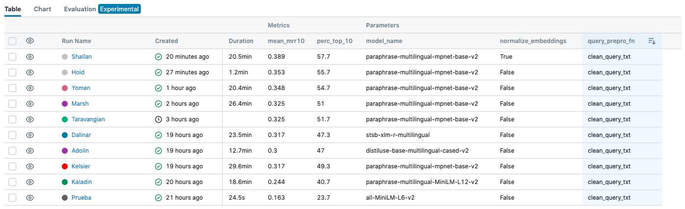
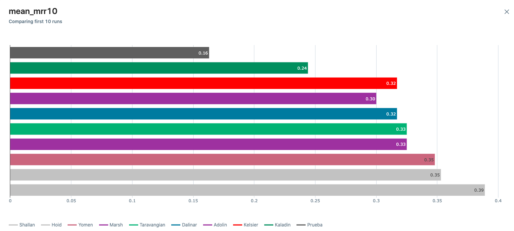
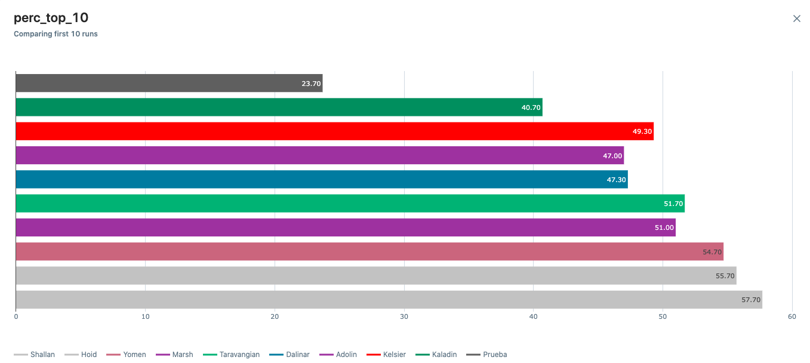

# Ejercicio de Ferrán

Este es un registro de las pruebas que yo, Ferrán Plana Caminero, he ido haciendo.  

## Una observación (y pregunta) teórica  

En este tipo de casos en que se van a modificar varios parámetros para intentar encontrar el conjunto que mejores resultados aporta, lo ideal sería probar con todas las combinaciones de parámetros. Sin embargo, esto da lugar a muchas combinaciones diferentes: si se quiere probar 3 opciones o valores diferentes para cada uno de los 3 parámetros a modificar, se deberían probar un total de 27 combinaciones diferentes.  

Otra opción para evitar tener que hacer tantas pruebas es asumir que los resultados y conclusiones obtenidos en el caso de un parámetro fijo son extendibles a otro valor de ese parámetro. Por ejemplo, lo que se va a hacer en este ejercicio es en primer lugar encontrar el modelo de _embeddings_ que mejores resultados da manteniendo el resto de parámetros constantes. Una vez encontrado el mejor, pasaremos a variar otro, pero asumiendo que el valor óptimo de ese parámetro para el nuevo modelo de _embeddings_ es el mismo que para otro.  

¿Esta hipótesis es adecuada como aproximación, o está muy alejadada de la realidad?

## Modelo de _Embeddings_

En primer lugar, vamos a intentar encontrar un modelo de _embeddings_ más adecuado, ya que el que se está usando actualmente (**_all-MiniLM-L6-v2_**) está entrenado únicamente en inglés. Para seleccionar el modelo más adecuado, investigamos en _huggingace_ y encontramos varios candidatos entre los que compararemos las métricas _mean_mrr10_ y _perc_top_10_.  

Los modelos han sido seleccionados de entre los más descargados de _hugging face_, y han sido:  

* **_all-MiniLM-L6-v2_** (el puesto por defecto)
* **_paraphrase-multilingual-MiniLM-L12-v2_** 
* **_paraphrase-multilingual-mpnet-base-v2_**
* **_distiluse-base-multilingual-cased-v2_**
* **_stsb-xlm-r-multilingual_**

| Model | mean_mrr10 | perc_top_10 |
|-|-|-|
| all-MiniLM-L6-v2 | 0.163 | 23.7 |
| paraphrase-multilingual-MiniLM-L12-v2 | 0.244 | 40.7 |
| paraphrase-multilingual-mpnet-base-v2 | 0.317 | 49.3 |
| distiluse-base-multilingual-cased-v2 | 0.3 | 47.0 |
| stsb-xlm-r-multilingual | 0.317 | 47.3 |

Visto esto, pasamos a utilizar el modelo de _embeddings_ **_paraphrase-multilingual-mpnet-base-v2_**.

## Función para hacer los _embeddings_

Ahora, manteniendo constante el modelo de _embeddings_, vamos a modificar la función usada para generar los _embeddings_ a partir del objeto _Movie_.  

Las distintas pruebas que vamos a hacer son:  

* Sinopsis (puesto por defecto)  
* Sinopsis+Género  
* Sinopsis+Género+Título  
* Sinopsis+Género+Título+Procesado
    * Quitar la palabra SINOPSIS  
    * Quitar paréntesis y signos de puntuación  
    * Quitar stop words

| Enfoque | mean_mrr10 | perc_top_10 |
|-|-|-|
| Sinopsis | 0.317 | 49.3 |
| Sinopsis+Género | 0.325 | 51.7 |
| Sinopsis+Género+Título | 0.325 | 51 |
| Sinopsis+Género+Título+Procesado | 0.348 | 54.7 |

## Función para procesar la query de entrada

Las dos opciones que vamos a probar son las siguientes:  

* Quitar "El usuario busca " (puesto por defecto)  
* Quitar "El usuario busca "+Procesado anterior

| Enfoque | mean_mrr10 | perc_top_10 |
|-|-|-|
| Quitando "El usuario busca " | 0.348 | 54.7 |
| Quitando "El usuario busca "+Procesado anterior | 0.353 | 55.7 |

## Normalizar _embeddings_  

Por último, voy a comparar los resultados al normalizar los vectores de _embeddings_.

| Normalización de embeddings | mean_mrr10 | perc_top_10 |
|-|-|-|
| No | 0.353 | 55.7 |
| Sí | 0.389 | 57.7 |

## Resultados finales

